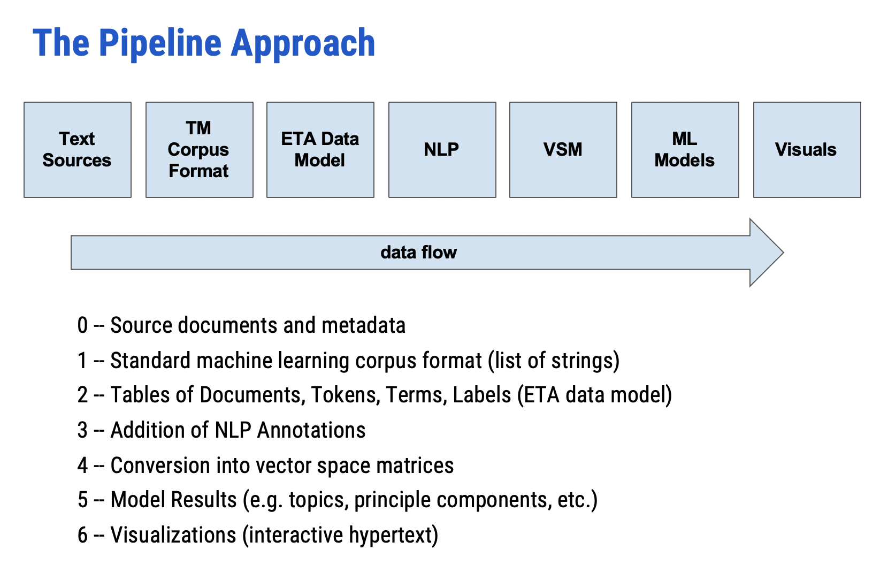
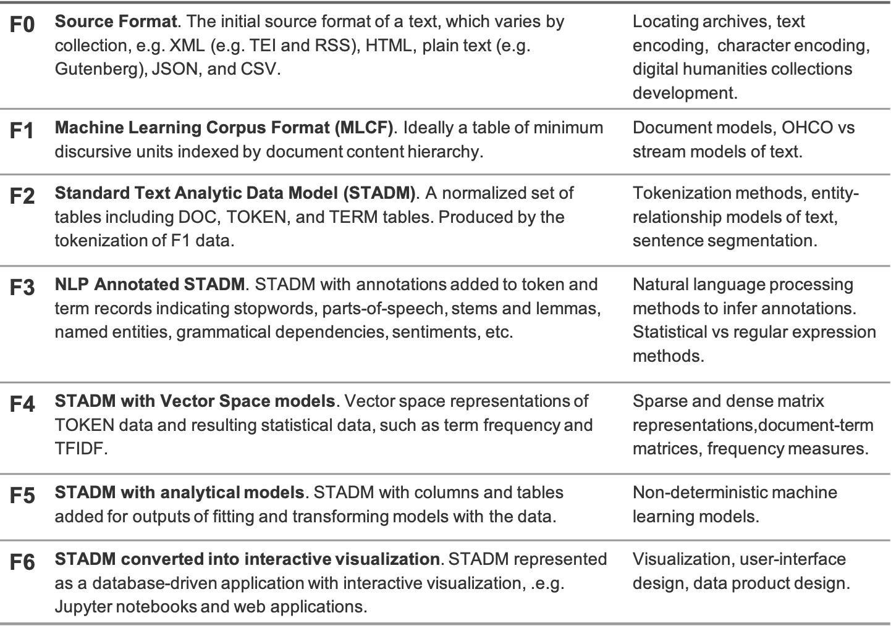

# DS 5001 Text Analytics Final Project

## [Project Instructions](https://docs.google.com/document/d/1kAD7CuOwSKmhEsqa8rQ_NjRaOw2PDDwmqF4-Bac0Nxw/edit#heading=h.gjdgxs)

## Deliverables
1. Compressed Source Files
    - Manifest File (text)
2. Data Files
    - LIBRARY.csv
    - TOKEN.csv
    - VOCAB.csv
3. Jupyter Notebooks
    - TFIDF: *Jason*
    - Principal Components: *Brigitte*
    - Topic Models (LDA): *Brigitte*
    - Word Embeddings (word2vec): *Jason*
    - Sentiment Analysis: *Jason*
    - Visuals (choose at least 3)
       - Hierarchical cluster diagrams
       - Heatmaps showing correlations
       - Scatter plots
       - KDE plots
       - Dispersion plots
       - t-SNE plots
4. Final Report (individual)

## Forms of Text Data

